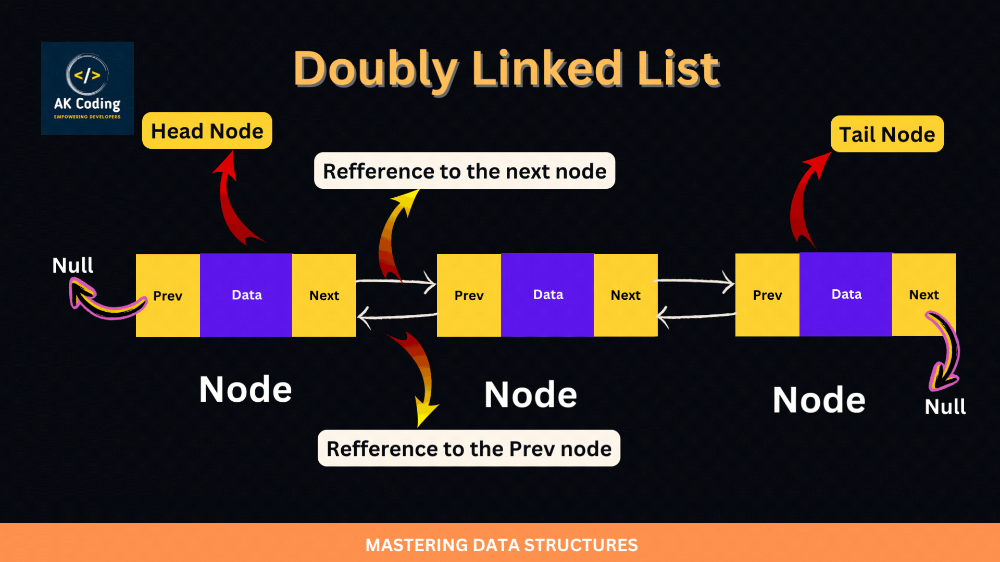

[](https://www.npmjs.com/package/@xstd/doubly-linked-list)


<picture>
  <source height="64" media="(prefers-color-scheme: dark)" srcset="https://github.com/xstd-js/website/blob/main/assets/logo/png/logo-large-dark.png?raw=true">
  <source height="64" media="(prefers-color-scheme: light)" srcset="https://github.com/xstd-js/website/blob/main/assets/logo/png/logo-large-light.png?raw=true">
  
</picture>

## @xstd/doubly-linked-list

<p align="center">
  <br>
  credits: <a href="https://akcoding.com/dsa/linear-data-structures/exploring-the-doubly-linked-lists/">akcoding</a>
</p>


A `DoublyLinkedList` implementation in typescript.

> A doubly linked list is a type of linked data structure where each node contains a data element and two pointers: one pointing to the previous node and one pointing to the next node in the sequence. This bidirectional structure allows for traversal in both directions, unlike a singly linked list which only allows forward traversal

A DoublyLinkedList is particularly useful in scenarios where frequent insertions and deletions are needed, especially when these operations are based on references to specific nodes (i.e., values) rather than just their positions. This data structure allows for efficient O(1) insertions and deletions from both ends, as well as from the middle, provided you have a reference to the node.

## 📦 Installation

```shell
yarn add @xstd/doubly-linked-list
# or
npm install @xstd/doubly-linked-list --save
```

## 📜 Documentation

See example and comments on classes/methods.

## ✍️ Example

```ts
// emitter.ts
interface Listener<GValue> {
  (value: GValue): void;
}

class Emitter<GValue> {
  readonly #listeners = new DoublyLinkedList<Listener<GValue>>();

  listen(listener: Listener<GValue>): () => void {
    const node = new DoublyLinkedListNode<Listener<GValue>>(listener);
    node.insertEnd(this.#listeners);

    return (): void => {
      // using a `DoublyLinkedList` is faster than using a classic Array, especially on large lists
      node.remove();
    };
  }

  dispatch(value: GValue): void {
    for (const listener of this.#listeners.values({ mutationTolerant: true })) {
      listener(value);
    }
  }
}

// main.ts
const emitter = new Emitter<number>();

emitter.listen((value: number): void => {
  console.log('listener-01', value);
});

const stopListener = emitter.listen((value: number): void => {
  console.log('listener-02', value);
});

emitter.dispatch(0);
// logs:
//   listener-01 0
//   listener-02 0

stopListener();

emitter.dispatch(1);
// logs:
//   listener-01 1
```

## 🚅 Benchmarks

| function | type / size | 1e1           | 1e2           | 1e3           | 1e4            | 1e5             | 1e6              | complexity |
|----------|-------------|---------------|---------------|---------------|----------------|-----------------|------------------|------------|
| insert   | array       |               |               |               |                |                 |                  | O(n)       |
|          | **list**    | 43.41x faster | 34.05x faster | 34.29x faster | 44.46x faster  | 142.23x faster  | 2868.78x faster  | O(1)       |
| remove   | array       |               |               |               |                |                 |                  | O(n)       |
|          | **list**    | 1.33x faster  | 1.29x faster  | 1.33x faster  | 1.33x faster   | 230.79x         | 4363.09x faster  | O(1)       |
| set      | **array**   | 1.37x faster  | 2.07x faster  | 21.94x faster | 313.30x faster | 3273.96x faster | 90363.91x faster | O(1)       |
|          | list        |               |               |               |                |                 |                  | O(n)       |
| unshift  | array       |               |               |               |                |                 |                  | O(n)       |
|          | **list**    | 30.92x faster | 35.78x faster | 37.90x faster | 44.57x faster  | 130.68x faster  | 2085.94x faster  | O(1)       |
| shift    | array       |               |               |               |                |                 |                  | O(n)       |
|          | **list**    | 1.08x faster  | 1.08x faster  | 1.04x faster  | 1.08x faster   | 207.38x faster  | 4379.04x faster  | O(1)       |
| push     | **array**   | 2.18x faster  | 1.93x faster  | 1.66x faster  | 1.95x faster   | 1.68x faster    | 1.92x faster     | O(1)       |
|          | list        |               |               |               |                |                 |                  | O(1)       |
| pop      | **array**   | 1.09x faster  | 1.12x faster  | 1.01x faster  | 1.00x faster   | 1.13x faster    | 1.22x faster     | O(1)       |
|          | list        |               |               |               |                |                 |                  | O(1)       |
| iterate  | **array**   | 7.53x faster  | 21.51x faster | 34.71x faster | 39.68x faster  | 35.40x faster   | 3.54x faster     | O(n)       |
|          | list        |               |               |               |                |                 |                  | O(n)       |

